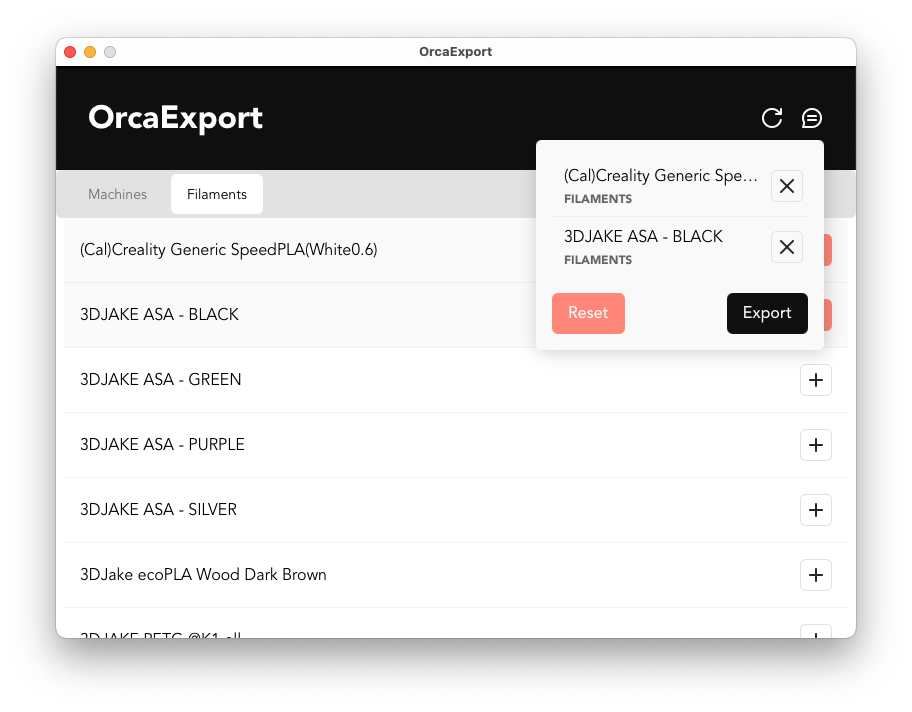
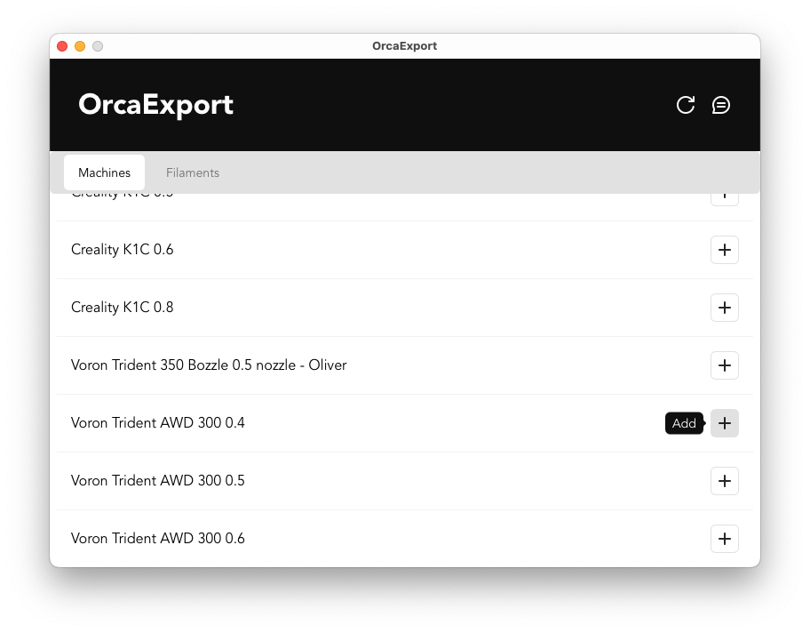

# OrcaExport

OrcaExport is a desktop application designed to help you manage and export your saved profiles from **OrcaSlicer**. 
With OrcaExport, you can easily select and export **Filament** or **Machine** profiles, streamlining your workflow and simplifying profile management.

## Screenshots

Here are some screenshots showcasing the application:

## Installation

1. Download the latest release from the [Releases](https://github.com/leventekk/orcaexport/releases/latest) section.
2. Run the installer and follow the setup instructions.
3. Launch **OrcaExport** and start managing your OrcaSlicer profiles.

## License

OrcaExport is released under the [MIT License](https://opensource.org/licenses/MIT).
